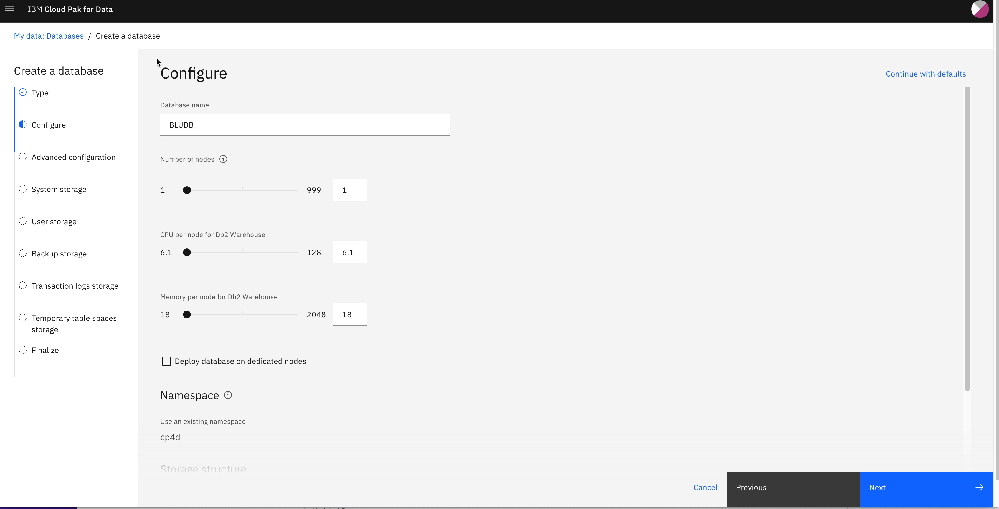

# CP4D - DB2 Warehouse service gitops module

This module populates a gitops repository with the resources necessary to provision the underlying DB2 Warehouse services that a pre-requisites to create a DB2 Warehouse instance. After this module is provisioned a DB2 Warehouse instance can then be created manually by following the steps below or by provisioning the [gitops-cp-db2wh](https://github.com/cloud-native-toolkit/terraform-gitops-cp-db2wh) module. 

## DB2WH Pre-Req

Ensure that a cluster administrator completed the required Pre-installation tasks for your environment. Specifically, verify that a cluster administrator completed the following tasks:

- Cloud Pak for Data is installed. 
- The cluster is configured to pull the Db2 Warehouse software images. 
  - Make sure the global pull secret is applied and worker nodes are replaced.
- The db2u-operator catalog source exists. 
- The db2u-operator operator subscription exists. 

If these tasks are not complete, the Db2 Warehouse installation will fail.

## Db2 Warehouse on Cloud Pak for Data

IBM Db2 Warehouse is an analytics data warehouse that features in-memory data processing and in-database analytics. It is client-managed and optimized for fast and flexible deployment, with automated scaling that supports analytics workloads. 

3 Namespace(s) are used in this module to support special installation

- operator_namespace: cpd-operators
  CP4D Platform operator, DB2WH Operator will be installed on cpd-operators

- common_services_namespace: ibm-common-services
   CP4D foundational services, Operand Deployment Lifecycle manager Operator and IBM zen service will be installed on the ibm-common-service namespace. 

- cpd_namespace: gitops-cp4d-instance
  DB2WH instance will be installed on gitops-cp4d-instance

## Cloud Pak for Data, Db2WH Subscription and Db2WHService instance gitops module

Module to provision a gitops repo with the resources necessary to provision a Cloud Pak for data,ibm-db2WH-cp4d-operator Subscription and Db2WHService instance on a cluster. In order to provision Subscription and the instance, the following steps are performed:

1. As we are using the Specialized installations architecture(where the IBM Cloud Pak foundational services operators and Cloud Pak for Data operators are in separate OpenShift projects), we must edit the IBM Cloud Pak foundational services operand registry to point to the project where the Cloud Pak for Data operators are installed: 
  - Edit the IBM Cloud Pak foundational services operand registry
  - Change the value of the namespace entry for the ibm-db2u-operator. Specify the OpenShift project where the Cloud Pak for Data operators are installed, for example, cpd-operators:
  - Save the changes
2. Add the db2wh Subscription chart to the gitops repo (charts/ibm-cpd-db2wh-subscription)
3. Add the Db2whService instance chart to the gitops repo (charts/ibm-cpd-db2wh-instance)

Unit tests is expected to be executed on a cluster that already has CP4D-instance and its dependencies installed and configured.
  
## Module dependencies

This module makes use of the output from other modules:

- GitOps - github.com/cloud-native-toolkit/terraform-tools-gitops.git
- Namespace - github.com/cloud-native-toolkit/terraform-gitops-namespace.git
- gitops_ibm_catalogs - github.com/cloud-native-toolkit/terraform-gitops-cp-catalogs.git
- gitops_cp_foundation - github.com/cloud-native-toolkit/terraform-gitops-cp-foundational-services.git
- gitops_cp4d_operator - github.com/cloud-native-toolkit/terraform-gitops-cp4d-operator.git
- gitops-cp4d-instance - github.com/cloud-native-toolkit/terraform-gitops-cp4d-instance.git

## Suggested companion modules

The module itself requires some information from the cluster and needs a namespace to be created. The following companion modules can help provide the required information:

- Gitops: github.com/cloud-native-toolkit/terraform-tools-gitops
- Gitops Bootstrap: github.com/cloud-native-toolkit/terraform-util-gitops-bootstrap
- Namespace: github.com/ibm-garage-cloud/terraform-cluster-namespace
- Pull Secret: github.com/cloud-native-toolkit/terraform-gitops-pull-secret
- Cert: github.com/cloud-native-toolkit/terraform-util-sealed-secret-cert
- Cluster: github.com/cloud-native-toolkit/terraform-ocp-login

### DB2WH Service check

Run this CLI and check if the DB2WHService completed.

- oc project gitops-cp4d-instance

- oc get Db2whService db2wh-cr -o jsonpath='{.status.db2whStatus} {"\n"}'
  
Db2 Warehouse is ready when the command returns "Completed".

### Create DB2WH database instance manually

#### Grant additional privileges

You must grant additional privileges to enable the web console to validate the CPU and memory values that you select for your deployment.

1. To add these privileges, run the following command on the OpenShift® cluster:

    ```shell
    oc adm policy add-cluster-role-to-user system:controller:persistent-volume-binder system:serviceaccount:${NAMESPACE}:zen-databases-sa
    ```

    `${NAMESPACE}` refers where you have created the DB2OLTP instances

2. After you run the command, the console is able to validate your selections by checking the available number of nodes on the cluster, whether the nodes are properly labeled and tainted, and the amount of available CPU and memory.

#### Create the instance from the console

You can manually create the database for DB2WH by following the instructions https://www.ibm.com/docs/en/cloud-paks/cp-data/4.0?topic=warehouse-creating-database-deployment

    > This step will create the database on the cluster using CP4D Console

This will create a database using many of the default values. You can adjust through the process for any resources you wish to change to support your requirements.



1. Login to CPD console
2. From the hamburger menu select "Data->Databases"
3. Click **Create a database** and select a database type. Click **Next**.
4. On the "Configure" step, provide the database name, number of nodes, CPU per node, and memory per node. Click **Next**.
5. On the "Advanced configuration" step, select `multiple logic nodes` and the `Analytics` workload. Click **Next**.
6. On the "System storage" step, select `portworx-db2-rwx-sc` and size of `100 GB`. Click **Next**.
7. On the "User storage" step, select `portworx-db2-rwx-sc (RWO with 4K block size)`, set the size to `100 GB`, and the access mode to `ReadWriteOnce`. Click **Next**. 
8. On the "Backup storage" step, click **Create new Storage**, select `Use storage template`, set the storage class to `portworx-db2-rwx-sc`, and set the size to `100 GB`. Click **Next**.
9. On the "Transaction logs storage" step, select `Use storage template`, set the storage class to `portworx-db2-rwx-sc (RWO with 4K block size)`, and the size to `100 GB`. Click **Next**.
10. On the "Temporary table spaces storage" step, select `Use storage template`, set the storage class to `portworx-db2-rwx-sc (RWO with 4K block size)`, and set the size to `100 GB`. Click **Finalize**.

As a result, Database for DB2WH will be created.

### DB2WH Service (instance) removal - Finalizer

Run this CLI and remove the finalizer value from the YAML as sometimes DB2WH service getting stuck.

- oc edit db2whservice db2wh-cr -n gitops-cp4d-instance

## Supported platforms

- OCP 4.8.36 

## References:

- [DB2 Warehouse Knowledge Center](https://www.ibm.com/docs/en/cloud-paks/cp-data/4.0?topic=services-db2-warehouse)
  
